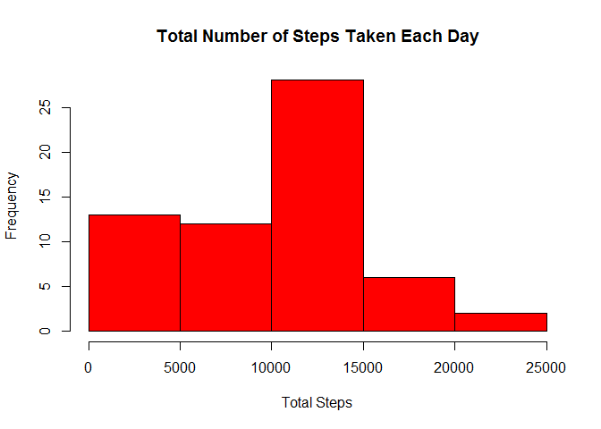
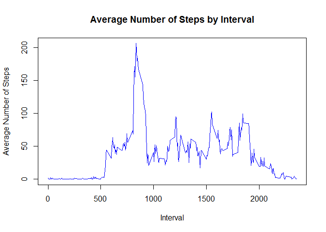
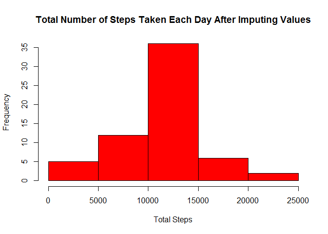
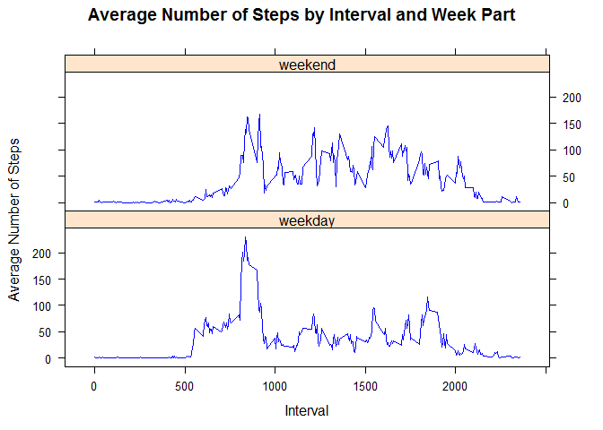

# Reproducible Research: Peer Assessment 1


## Loading and preprocessing the data


```r
## Load dplyr package
library(dplyr)
```

```
## 
## Attaching package: 'dplyr'
## 
## The following objects are masked from 'package:stats':
## 
##     filter, lag
## 
## The following objects are masked from 'package:base':
## 
##     intersect, setdiff, setequal, union
```

```r
## Load data to data table 
data <- tbl_df(read.csv("activity.csv", stringsAsFactors = FALSE))

## Convert Date column to date type
data$date <- as.Date(data$date, format = "%Y-%m-%d")
```

## What is mean total number of steps taken per day?


```r
## Group by date and then sum the total number of steps
totalSteps <- group_by(data, date) %>% 
    summarize_each(funs(sum(., na.rm = TRUE))) 

## Create a histogram of total number of steps
hist(totalSteps$steps, 
     col = "red", 
     xlab = "Total Steps", 
     main = "Total Number of Steps Taken Each Day")
```

 

```r
## Calculate the mean and save to a variable
meanSteps <- mean(totalSteps$steps)
```

The mean number of steps taken each day is 9354.2295082  


```r
## Calculate the median and save to a variable
medianSteps <- median(totalSteps$steps)
```

The median number of steps taken each day is 10395  


## What is the average daily activity pattern?


```r
## Select the steps and interval columns, Group by interval and then get the average number of steps for each interval
avgStepsPerInterval <- select(data, steps, interval) %>% 
    group_by(interval) %>% 
    summarize_each(funs(mean(., na.rm = TRUE))) 

## Plot steps per interval
plot(avgStepsPerInterval$interval, 
     avgStepsPerInterval$steps, 
     type = "l", 
     xlab = "Interval", 
     ylab = "Average Number of Steps", 
     col="blue", 
     main = "Average Number of Steps by Interval") 
```

 


```r
maxActiveInterval <- avgStepsPerInterval[which.max(avgStepsPerInterval$steps),]$interval
```

The 5 minute interval that contains the maximum number of steps on average over all days is 835   

## Imputing missing values


```r
## Get the number of rows with missing values
naRows <- nrow(data[!complete.cases(data),])
```

There are 2304 rows with missing values in the dataset.


```r
## Create a copy of the data frame
fullData <- data

## Fill missing steps values with the average for the interval
fullData$steps <- ifelse(is.na(fullData$steps), avgStepsPerInterval$steps[match(fullData$interval, avgStepsPerInterval$interval)], fullData$steps)

## Group by date and then sum the total number of steps
fullDataTotalSteps <- group_by(fullData, date) %>% 
    summarize_each(funs(sum(., na.rm = TRUE))) 

## Create a histogram of total number of steps
hist(fullDataTotalSteps$steps, 
     col = "red", 
     xlab = "Total Steps", 
     main = "Total Number of Steps Taken Each Day After Imputing Values")
```

 

```r
## Calculate the mean and save to a variable
fullDataMeanSteps <- mean(fullDataTotalSteps$steps)
```

The mean number of steps taken each day after imputing values is 1.0766189\times 10^{4}  


```r
## Calculate the median and save to a variable
fullDataMedianSteps <- median(fullDataTotalSteps$steps)
```

The median number of steps taken each day after imputing values is 1.0766189\times 10^{4}  

These values differ from the estimates from the first part of the assignment.  

After imputing missing data the total daily number of steps skews to the average as expected.  


## Are there differences in activity patterns between weekdays and weekends?


```r
## Create the factor column weekPart and assign the appropriate value
fullData$weekPart <- factor(ifelse(weekdays(fullData$date) %in% c("Saturday", "Sunday"),"weekend", "weekday"))

## Select the steps interval, and weekPart columns, Group by interval and weekPart  then get the average number of steps for each interval per weekPart
avgStepsPerIntervalByWeekPart <- select(fullData, steps, interval, weekPart) %>% 
    group_by(interval, weekPart) %>% 
    summarize_each(funs(mean(., na.rm = TRUE))) 

library(lattice)

## Plot steps per interval and weekPart
xyplot(steps ~ interval | weekPart,
       data = avgStepsPerIntervalByWeekPart,
       type = "l", 
       xlab = "Interval", 
       ylab = "Average Number of Steps", 
       col = "blue", 
       layout=c(1,2),
       main = "Average Number of Steps by Interval and Week Part")
```

 
